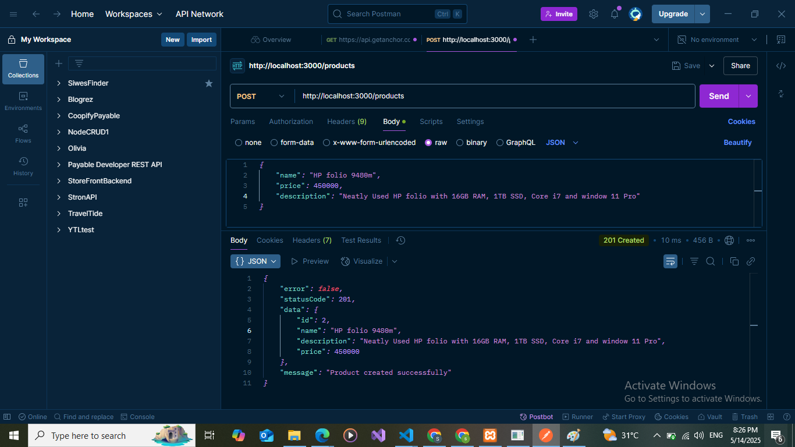
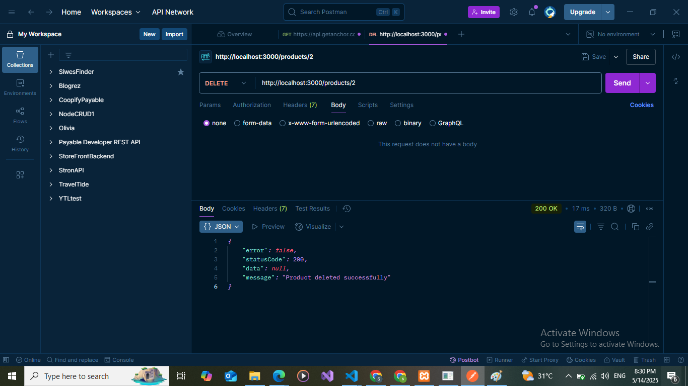
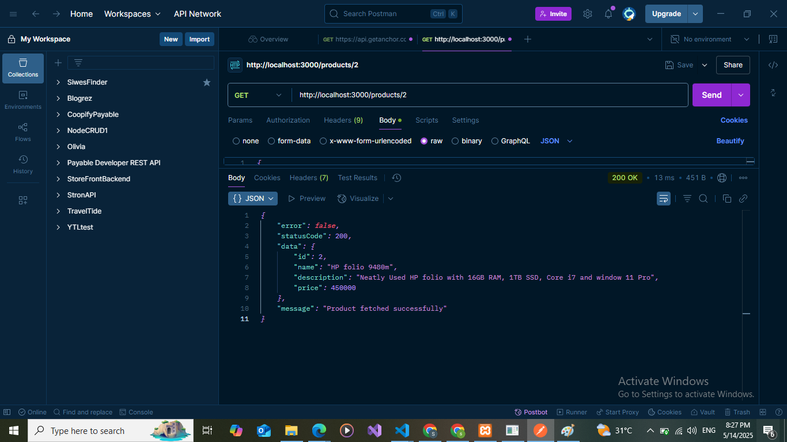

# Express API Project

This README provides instructions on how to set up and run the Express API project.

## Prerequisites

Ensure you have the following installed on your system:
- [Node.js](https://nodejs.org/) (v14 or later)
- [npm](https://www.npmjs.com/) or [yarn](https://yarnpkg.com/)

## Setup Instructions

1. **Clone the Repository**  
    ```bash
    git clone https://github.com/your-username/your-repo-name.git
    cd backend/express_api
    ```

2. **Install Dependencies**  
    Run the following command to install all required dependencies:  
    ```bash
    npm install
    ```


## Running the Project

1. **Start the Development Server**  
    Use the following command to start the server in development mode:  
    ```bash
    npm run dev
    ```

2. **Start the Production Server**  
    Build the project and start the server in production mode:  
    ```bash
    npm start
    ```

3. **Access the API**  
    Once the server is running, access the API at:  
    ```
    http://localhost:<PORT>/api
    ```

## Scripts

- `npm run dev` - Starts the server in development mode with hot-reloading.
- `npm start` - Starts the server in production mode.


## API Documentation
This project is built using Node.js (v14 or later). 
It includes an Express-based API for handling backend operations.

### Base URL
`http://<your-server-domain>/api`

### Endpoints

1. **GET /products**
    - Description: Retrieves data from the server.
    - Response: JSON object containing all products.
    - Example Response:  
    

2. **POST /products**
    - Description: Sends data to the server.
    - Request Body: JSON object with the required fields (name, price, and description).
    - Response: JSON object confirming the operation.
    - Example Response:  
    

3. **PUT /products/:id**
    - Description: Updates data on the server for a specific product.
    - Parameters: `id` (Path parameter - ID of the product to update).
    - Request Body: JSON object with updated fields (e.g price, name, or description).
    - Response: JSON object confirming the update.
    - Example Response:  
    

4. **DELETE /products/:id**
    - Description: Deletes a specific product from the server.
    - Parameters: `id` (Path parameter - ID of the specific product to delete).
    - Response: JSON object confirming the deletion.
    - Example Response:  
    

5. **GET /products/:id**
    - Description: gate data on the server for a product resource.
    - Parameters: `id` (Path parameter - ID of the product to update).
    - Response: JSON object confirming the fetch operation.
    - Example Response:  
    

### Prerequisites
- Ensure Node.js (v14 or later) is installed on your system.
- Install project dependencies using `npm install`.

### Usage
- Start the server using `npm start` or `node server.js`.
- Access the API endpoints via the base URL.

For further details, refer to the source code or contact the project maintainer.

## Authors
- Saad Saheed

## Contributing

Feel free to fork this repository and submit pull requests for improvements.

## License

This project is licensed under the [ISC License](LICENSE).
